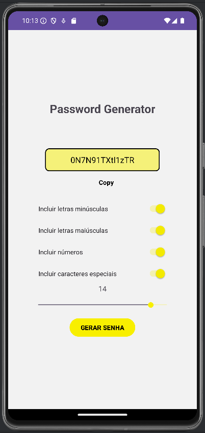

# Gerador de Senhas

Este é um projeto Android de um **Gerador de Senhas** desenvolvido para o curso do Professor Junio. Este aplicativo permite ao usuário gerar senhas seguras com diferentes tipos de caracteres, incluindo letras maiúsculas, minúsculas, números e caracteres especiais.

## 📸 Captura de Tela

Aqui está uma imagem do aplicativo em funcionamento:

## 🚀 Funcionalidades

- Gera senhas fortes com base nas preferências do usuário
- Permite escolher entre letras maiúsculas, minúsculas, números e caracteres especiais
- Permite ajustar o tamanho da senha usando um controle deslizante (SeekBar)
- Opção para copiar a senha gerada para a área de transferência

## ⚙️ Tecnologias Utilizadas

- **Linguagem:** Kotlin
- **IDE:** Android Studio
- **Componentes do Android:** TextView, Button, SeekBar, Switch

## 📲 Como Usar

1. Baixe e instale o aplicativo.
2. Escolha as opções de caracteres (letras maiúsculas, minúsculas, números e/ou caracteres especiais).
3. Ajuste o comprimento desejado para a senha usando o controle deslizante.
4. Pressione o botão "Gerar Senha" para criar uma senha segura.
5. Use o botão "Copy" para salvar a senha gerada na área de transferência.

## 📁 Estrutura do Projeto

- **MainActivity.kt:** Contém a lógica principal do aplicativo.
- **res/layout:** Contém os arquivos de layout XML para as telas do aplicativo.
- **res/drawable:** Armazena os recursos gráficos, como ícones e imagens.

## 📚 Contribuições

Sugestões para melhorias são bem-vindas! Se tiver interesse em contribuir, sinta-se à vontade para fazer um _fork_ do projeto e enviar um _pull request_.

## 📜 Licença

Este projeto é para uso educacional e foi desenvolvido como parte de uma atividade prática para o curso de desenvolviemnto mobile ministrado pelo Professor Junio.
